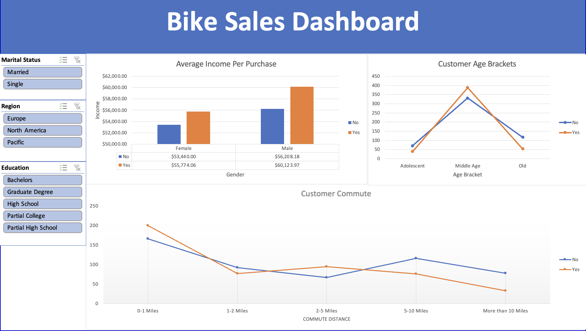
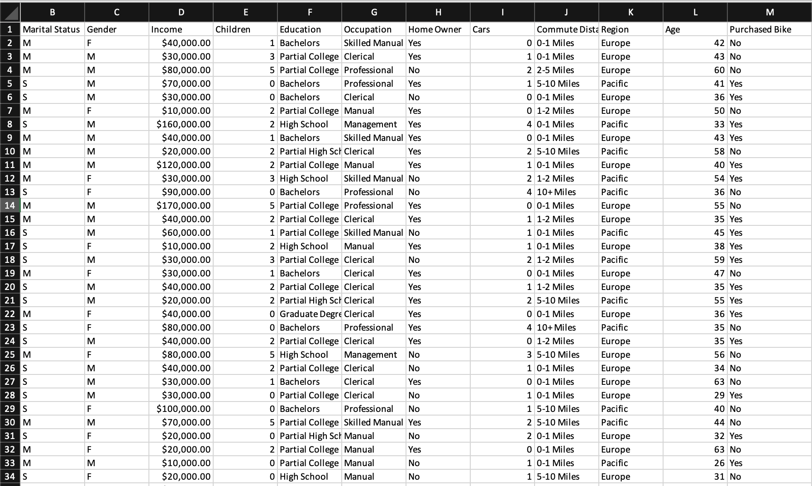
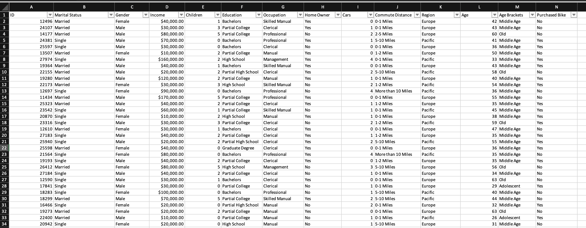
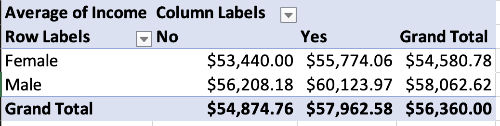
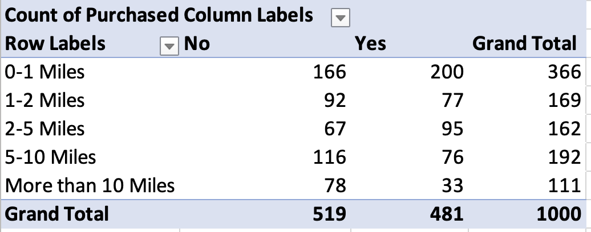
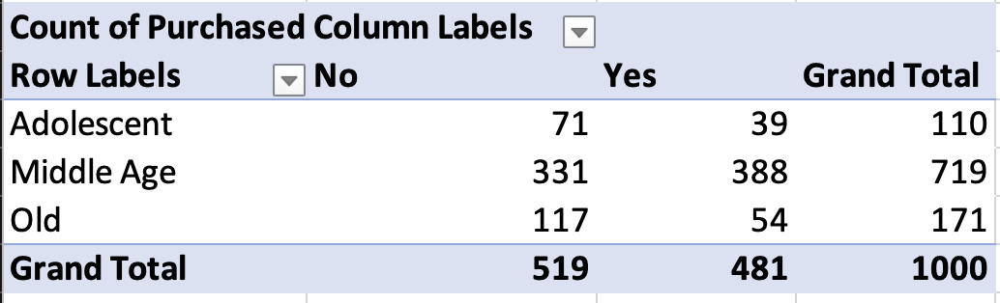

# Bike Sales

## Objective:
The objective of this project is to use Microsoft Excel to evaluate bike sales relative to specific factors such as marital status, gender, income, education, commute distance, and age. 

## Original Data

### Processed Data
To prepare the data, I applied data preprocessing techniques such as removing duplicates, using filtering, categorizing the age into age brackets, and making the commute distance, gender, and marital status easier to understand by changing the abbreviations into conventional terminology. 
 

## Pivot Tables

## Dashboard

